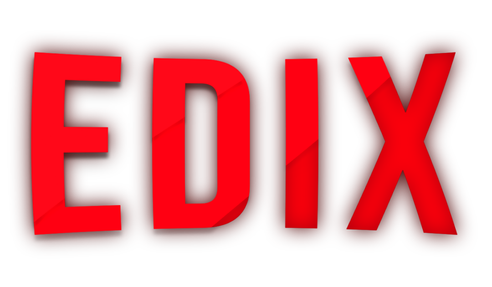

---

<h1 align="center">🎬Edix</h1>

<h3 align="center">🚧 STATUS 🚀 Em construção... 🚧</h3>

---

<h2 align="center">📖Sobre</h2>

O projeto consiste em ser um tipo uma netflix só que com edits daí o nome Edix.
Nele é usado principalmente a biblioteca de slide "SwiperJS" e para carregar os vídeos a "VideoJS",
e para visualizar a edit basta dar 2 cliques em cima dela. 100% responsivo

---

<h2 align="center">✔O site contém:</h2>

✅ Responsividade 
✅ Animações 
✅ Slide 
✅ Biblioteca Javascript VIDEOJS 
### etc..

---

<h2 align="center">🖥Preview</h2>

</img>
 
 
 
</img>

### Veja o projeto em funcionamento <a href="https://gabriell-c.github.io/Edix/">aqui</a>. 🧐

---

<h2 align="center">🛠 Tecnologias</h2>

- [HTML](https://html.com/)
- [CSS](https://developer.mozilla.org/pt-BR/docs/Web/CSS)
- [JavaScript](https://www.javascript.com/)

---

<h2 align="center">📝Licença</h2>

   Este repositório está sob licença MIT. Você pode ver o arquivo <a href="https://github.com/gabriell-c/Edix/blob/main/LICENSE"> LICENSE</a> para mais detalhes. 😉

